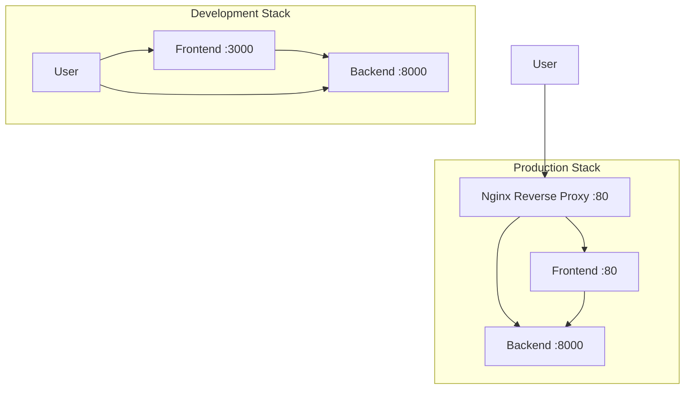

# 🐳 Docker 部署指南

## 📦 Docker 配置概览

OZX Image Atlas Tool 提供完整的 Docker 容器化部署解决方案，支持开发和生产环境。

### 🏗️ **架构组件**



## 📁 **文件结构**

```
ozx_image_atlas/
├── docker-compose.yml        # 主要编排文件
├── docker-start.sh           # 快速启动脚本
├── .dockerignore             # Docker 忽略文件
├── backend/
│   ├── Dockerfile            # 后端容器配置
│   └── .dockerignore         # 后端忽略文件
├── frontend/
│   ├── Dockerfile            # 前端容器配置
│   ├── nginx.conf            # 前端 Nginx 配置
│   └── .dockerignore         # 前端忽略文件
└── nginx/
    └── nginx.conf            # 生产反向代理配置
```

## 🚀 **快速启动**

### 方式 1: 使用启动脚本（推荐）

```bash
# 开发模式
./docker-start.sh

# 生产模式
./docker-start.sh --production

# 强制重新构建
./docker-start.sh --build

# 查看帮助
./docker-start.sh --help
```

### 方式 2: 直接使用 Docker Compose

```bash
# 开发模式
docker-compose up -d

# 生产模式（包含 nginx 反向代理）
docker-compose --profile production up -d

# 重新构建并启动
docker-compose up -d --build
```

## 🔧 **环境配置**

### 开发环境 (Development)
- **前端**: http://localhost:3000
- **后端**: http://localhost:8000
- **特点**: 热重载、详细日志、调试模式

### 生产环境 (Production)
- **应用**: http://localhost (通过 nginx 反向代理)
- **前端**: http://localhost:3000 (直接访问)
- **后端**: http://localhost:8000 (直接访问)
- **特点**: 性能优化、安全加固、负载均衡

## 🛠️ **容器详情**

### 后端容器 (ozx-atlas-backend)

```dockerfile
# 基础镜像: python:3.11-slim
# 端口: 8000
# 用户: atlas (非 root)
# 健康检查: HTTP GET /
```

**特性**:
- ✅ 多阶段构建优化
- ✅ 非 root 用户运行
- ✅ 健康检查配置
- ✅ PIL/Pillow 图像处理库
- ✅ 生产级 Uvicorn 服务器

### 前端容器 (ozx-atlas-frontend)

```dockerfile
# 构建阶段: node:18-alpine
# 运行阶段: nginx:alpine
# 端口: 80
# 用户: atlas (非 root)
```

**特性**:
- ✅ 多阶段构建（Node.js 构建 + Nginx 服务）
- ✅ 静态文件缓存配置
- ✅ Gzip 压缩
- ✅ 安全头设置
- ✅ 健康检查端点

### Nginx 反向代理 (生产模式)

```nginx
# 前端路由: / -> frontend:80
# API 路由: /v1/ -> backend:8000
# 健康检查: /health
```

**特性**:
- ✅ 负载均衡和反向代理
- ✅ 速率限制（API: 10 req/s, 一般: 30 req/s）
- ✅ 静态文件缓存（1年）
- ✅ 安全头配置
- ✅ 大文件上传支持（200MB）

## 📊 **管理命令**

### 启动和停止

```bash
# 启动所有服务
./docker-start.sh

# 停止所有服务
./docker-start.sh --down

# 重启服务
docker-compose restart

# 重启特定服务
docker-compose restart backend
docker-compose restart frontend
```

### 查看状态和日志

```bash
# 查看容器状态
./docker-start.sh --status

# 查看实时日志
./docker-start.sh --logs

# 查看特定服务日志
docker-compose logs -f backend
docker-compose logs -f frontend

# 查看容器资源使用
docker stats
```

### 维护操作

```bash
# 进入容器
docker-compose exec backend bash
docker-compose exec frontend sh

# 查看容器详情
docker-compose ps -a

# 清理无用镜像和容器
docker system prune -a

# 查看网络
docker network ls
docker network inspect ozx-atlas-network
```

## 🔍 **健康检查**

每个容器都配置了健康检查：

```bash
# 检查所有容器健康状态
docker-compose ps

# 手动健康检查
curl http://localhost:8000/        # 后端
curl http://localhost:3000/        # 前端
curl http://localhost/health       # Nginx（生产模式）
```

## 🛡️ **安全特性**

### 容器安全
- ✅ **非 root 用户**: 所有容器使用专用用户运行
- ✅ **最小镜像**: 使用 alpine 和 slim 基础镜像
- ✅ **依赖扫描**: 定期更新依赖
- ✅ **只读文件系统**: 生产环境推荐

### 网络安全
- ✅ **内部网络**: 服务间通过内部网络通信
- ✅ **端口控制**: 只暴露必要端口
- ✅ **代理隔离**: 生产环境通过 nginx 代理访问

### 应用安全
- ✅ **速率限制**: 防止 API 滥用
- ✅ **文件上传限制**: 200MB 文件大小限制
- ✅ **安全头**: 防 XSS、CSRF 等攻击
- ✅ **CORS 配置**: 限制跨域请求

## 📈 **性能优化**

### 缓存策略
- **静态资源**: 1年缓存
- **API 响应**: 无缓存（实时数据）
- **Nginx 缓存**: Gzip 压缩

### 资源限制
```yaml
# 在 docker-compose.yml 中添加
deploy:
  resources:
    limits:
      cpus: '0.5'
      memory: 512M
    reservations:
      cpus: '0.25'
      memory: 256M
```

## 🔧 **开发调试**

### 开发模式启动
```bash
# 挂载源代码进行开发
docker-compose -f docker-compose.dev.yml up -d
```

### 调试技巧
```bash
# 查看构建过程
docker-compose build --no-cache

# 交互式运行
docker-compose run --rm backend bash
docker-compose run --rm frontend sh

# 检查端口占用
netstat -tulpn | grep :8000
netstat -tulpn | grep :3000
```

## 📋 **故障排除**

### 常见问题

1. **端口占用**
   ```bash
   # 检查端口使用
   lsof -i :8000
   lsof -i :3000
   
   # 停止占用进程
   ./docker-start.sh --down
   ```

2. **容器无法启动**
   ```bash
   # 查看详细错误
   docker-compose logs backend
   docker-compose logs frontend
   
   # 重新构建
   ./docker-start.sh --build
   ```

3. **镜像构建失败**
   ```bash
   # 清理 Docker 缓存
   docker system prune -a
   
   # 逐步构建
   docker build -t ozx-backend ./backend
   docker build -t ozx-frontend ./frontend
   ```

4. **网络连接问题**
   ```bash
   # 检查网络
   docker network ls
   docker network inspect ozx-atlas-network
   
   # 重新创建网络
   docker-compose down
   docker network prune
   docker-compose up -d
   ```

## 📝 **部署清单**

### 生产部署前检查
- [ ] ✅ 镜像构建成功
- [ ] ✅ 健康检查通过
- [ ] ✅ 安全扫描完成
- [ ] ✅ 性能测试完成
- [ ] ✅ 备份策略制定
- [ ] ✅ 监控配置完成

### 生产环境建议
- [ ] 使用外部数据库（如需要）
- [ ] 配置日志聚合
- [ ] 设置监控告警
- [ ] 配置 HTTPS/SSL
- [ ] 设置定时备份
- [ ] 配置容器重启策略

---

## 🎉 **现在您可以使用 Docker 轻松部署 OZX Image Atlas Tool！**

开始使用：
```bash
./docker-start.sh
```

或查看完整选项：
```bash
./docker-start.sh --help
```